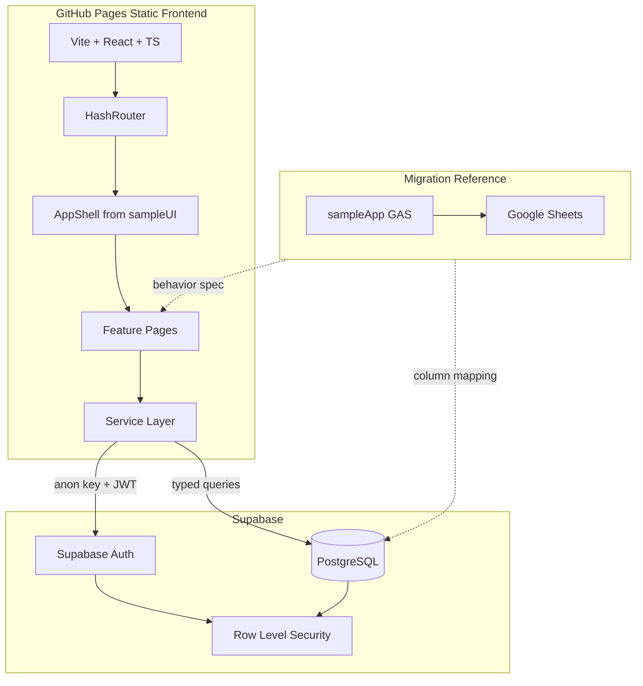

# Project Tracker — Full Migration Execution Plan

## Current Status (per AGENTS.md startup)

| Area | State |
|------|-------|
| React app | **Complete** — full feature set in `src/` |
| Supabase | **Connected** — CNF Tracker Ver 2.0 (`byhxwretspcxrrkvovgq`); migrations 001–006 applied |
| Legacy reference | **Complete** — [`sampleApp/Code.gs`](sampleApp/Code.gs), [`Index.html`](sampleApp/Index.html), [`Script.html`](sampleApp/Script.html) |
| UI reference | **Borrowed snippets** — [`sampleUI/layout/`](sampleUI/layout/), [`reference/dashboard.tsx`](reference/dashboard.tsx) |
| Git | **Initialized** — deployed to GitHub Pages |
| Env | `.env.local` configured; `.env.example` present |
| Latest handoff | [`agent-history/version-31-handoff.md`](agent-history/version-31-handoff.md) |

**Remaining:** GitHub secrets sync (`scripts/setup-github.ps1`), production Auth redirect URL confirmation, Google Sheets data import (optional), end-to-end UI smoke test in browser.

---

## Architecture



**Rule precedence:** [`project-context.mdc`](.cursor/rules/project-context.mdc) (always apply) wins over [`reactVite2026.mdc`](.cursor/rules/reactVite2026.mdc). Use **React Router HashRouter**, **Ant Design**, **service files**, and the folder layout from project-context — not TanStack Router / Orval / Axios.

---

## Target Routes (from legacy nav, not sampleUI CNF routes)

| Route | Legacy page | Role notes |
|-------|-------------|------------|
| `#/login` | — | Public |
| `#/dashboard` | Dashboard | All authenticated |
| `#/projects` | Projects form | Role-field sections enforced in UI + RLS |
| `#/projects/database` | Projects Database | View+ export |
| `#/support-activities` | Support Activities | TSD/RnD fields |
| `#/audit-trail` | Audit Trail | Admin + View |
| `#/archived` | Archived | Admin |
| `#/registry` | Registry | Admin |

---

## Supabase Schema (Phase 2)

Map legacy sheet headers from [`sampleApp/Code.gs`](sampleApp/Code.gs) lines 28–147 to normalized PostgreSQL tables.

**Core tables:**

- `profiles` — `id` (auth FK), `email`, `full_name`, `role` (`am_bm_pl`, `pp`, `tsd`, `val`, `qc`, `admin`, `view`)
- `cnf_projects` — PO-line flat storage matching `PROJECT_HEADERS` (preserve `batch_instance_id`, `mo_instance_id`, `po_instance_id`, `cnf_entries_json`, audit columns, `is_active`)
- `support_activities` — matches `SUPPORT_HEADERS`
- `notifications` — FG Month-driven alerts
- `audit_logs` — immutable, plain-English field diffs
- `registry` — lookup values
- `admin_messages` — user → admin messages

**SQL location:** `supabase/migrations/001_initial_schema.sql`, `002_rls_policies.sql`

**RLS strategy:**
- `admin` — full CRUD on all tables
- `view` — SELECT only
- Department roles — UPDATE only on their field groups (enforced via column-level update policies or RPC wrappers; start with table-level read + restricted update policies per role)
- `audit_logs` — INSERT via service pattern from frontend; no UPDATE/DELETE for non-admin

**Auth trigger:** `on_auth_user_created` → insert `profiles` row with default `view` role (admin promotes via UI later).

---

## Recommended `src/` Structure

Per project-context (not reactVite2026):

```text
src/
  app/App.tsx, router.tsx, auth-provider.tsx, theme-provider.tsx
  components/layout/     ← ported from sampleUI/
  components/forms/      ← hierarchical project form
  components/tables/     ← database, audit, support views
  components/dashboard/  ← KPI cards, charts
  features/projects/, support-activities/, dashboard/, audit-trail/, registry/, auth/
  lib/supabaseClient.ts, auth.ts, utils.ts, constants.ts
  types/database.ts, project.ts, supportActivity.ts, user.ts
  services/projectService.ts, supportActivityService.ts, dashboardService.ts, auditService.ts, exportService.ts
  styles/globals.css
```

---

## Phased Execution (AGENTS.md versions)

Each phase ends with: implementation, verification (`npm run build` + manual smoke test), `agent-history/version-N-handoff.md`, and git commit `vN: summary` (when you request commits).

### Phase 1 — v19: Repository Bootstrap

**Goal:** Runnable empty shell connected to Supabase.

- Initialize git; add [`.gitignore`](.gitignore) (exclude `.env.local`) and [`.env.example`](.env.example) with `VITE_SUPABASE_URL`, `VITE_SUPABASE_ANON_KEY`, `VITE_BASE_PATH=/ProjectTracker_React/`
- Scaffold Vite + React 19 + TypeScript via `npm create vite@latest`
- Install: `@supabase/supabase-js`, `react-router-dom`, `antd`, `@ant-design/icons`, `dayjs`, `xlsx` (export)
- Configure [`vite.config.ts`](vite.config.ts): `base: '/ProjectTracker_React/'`
- Wire [`src/lib/supabaseClient.ts`](src/lib/supabaseClient.ts) from existing `.env.local`
- Port and adapt layout from [`sampleUI/layout/`](sampleUI/layout/) with **Project Tracker nav** (7 legacy pages)
- Add `HashRouter`, auth provider (`getUser()` not `getSession()`), login page, protected route wrapper
- Placeholder pages with loading states
- Add GitHub Actions workflow for Pages deploy (`.github/workflows/deploy.yml`)

**Verify:** `npm run dev` loads login → dashboard shell; `npm run build` succeeds.

---

### Phase 2 — v20: Database Schema + Types

**Goal:** Empty Supabase ready for data.

- Write SQL migrations from `PROJECT_HEADERS`, `SUPPORT_HEADERS`, etc.
- Apply migrations to Supabase project `asukusfiiqxjjihohnzi`
- Enable RLS on every table; seed `registry` defaults from legacy `REGISTRY` patterns in Code.gs
- Generate TypeScript types in [`src/types/`](src/types/) matching DB columns (snake_case DB → camelCase TS mappers in services)
- Add [`src/services/auditService.ts`](src/services/auditService.ts) with `logAuditDiff` pattern from legacy `logAuditDiff_`

**Verify:** Supabase dashboard shows tables; anon client can read registry with test user JWT; RLS blocks unauthenticated writes.

---

### Phase 3 — v21: Authentication + Role Navigation

**Goal:** Users log in; UI and DB respect roles.

- Login / logout / session refresh via Supabase Auth
- `profiles` CRUD for admin (user management page stub)
- Sidebar shows/hides nav items by role (AM/BM/PL, PP, TSD, VAL, QC, Admin, View)
- Route guards mirror sidebar rules

**Verify:** Test users per role see correct nav; unauthorized routes redirect.

---

### Phase 4 — v22: Project Service + Hierarchical Form

**Goal:** Core business entity — recreate legacy Projects page.

**Reference logic:**
- [`saveProject`](sampleApp/Code.gs) / [`updateProject`](sampleApp/Code.gs) — ID generation, duplicate review, `cnf_entries_json`
- [`buildProjectHierarchy_`](sampleApp/Code.gs) — Project → Batch → MO → PO tree
- [`Script.html`](sampleApp/Script.html) — expand/collapse, copy-from-first-PO, N/A view

**Deliver:**
- [`src/services/projectService.ts`](src/services/projectService.ts) — CRUD, hierarchy builder, instance ID generation
- [`src/features/projects/ProjectEntryPage.tsx`](src/features/projects/ProjectEntryPage.tsx) — role-sectioned form
- Audit logging on every create/update/delete/archive
- Confirmation modal for duplicate detection (legacy behavior)

**Verify:** Create project with 2 batches / MOs / POs; reload preserves hierarchy; audit entry written.

---

### Phase 5 — v23: Projects Database + Export

**Goal:** Searchable flat table view with Excel export.

- Filters: owner, activity type, CNF status, final status, FG month/year (from legacy `databasePage`)
- Sort, pagination, column visibility
- [`src/services/exportService.ts`](src/services/exportService.ts) — XLSX from filtered Supabase data (replaces Apps Script export)

---

### Phase 6 — v24: Support Activities

**Goal:** TSD/RnD activity tracking separate from CNF lifecycle.

- Form with `activity_kind` toggle (TSD vs RnD field sets from `SUPPORT_HEADERS`)
- Database view + export
- Audit on writes

---

### Phase 7 — v25: Dashboard + Notifications

**Goal:** Management KPIs and FG Month alerts.

**Reference:**
- [`getDashboardData`](sampleApp/Code.gs) — KPI counts, due windows, department pending
- [`reference/dashboard.tsx`](reference/dashboard.tsx) — Ant Design card/chart patterns (recompute metrics for Project Tracker fields)
- Notification refresh logic from Code.gs `refreshNotifications_`

**Deliver:** KPI cards, CNF/final status distribution, support overview, worklist, notification bell (adapt [`sampleUI/layout/notification-center.tsx`](sampleUI/layout/notification-center.tsx))

---

### Phase 8 — v26: Audit Trail, Archived, Registry

- Audit Trail: date/user/module/action filters, plain-English old/new values
- Archived: `is_active = false` projects + support
- Registry: admin CRUD for dropdown values

---

### Phase 9 — v27: Data Migration from Google Sheets

**Goal:** Move production sheet data into Supabase.

- Export sheets as CSV/Excel from current GAS deployment
- Node script in `scripts/migrate-sheets-to-supabase.ts` (uses **service role key locally only**, never committed)
- Column mapping doc in `scripts/migration-map.md`
- Clean `N/A`, normalize dates/booleans, preserve `project_id` and instance IDs
- Validate record counts and spot-check hierarchy in React UI

---

### Phase 10 — v28: GitHub Pages Production Deploy

- Confirm `VITE_BASE_PATH=/ProjectTracker_React/`
- GitHub Actions: build → deploy `dist/` to Pages
- Post-deploy smoke test on `https://carlolidres.github.io/ProjectTracker_React/#/dashboard`
- Document manual Supabase Auth redirect URLs for production origin

---

## Key Implementation Rules

1. **Never** put service role key in frontend or committed files
2. **Always** write audit logs on mutations (readable old/new values, user email, timestamp)
3. **Preserve** legacy field names in DB where practical to ease migration; map to readable labels in UI
4. **Use** `getUser()` for auth checks (not `getSession()`)
5. **Follow** vibeStack constraint: ~3–4 files per implementation turn, then review diff
6. **Defer** features not in legacy app (CNF AI chatbot in sampleUI topbar, Lessons Learned, KPI Performance pages from other project)

---

## Risks

| Risk | Mitigation |
|------|------------|
| Column-level RLS for department roles is complex | Start with UI field disabling + table-level policies; refine with RPC if needed |
| `cnf_entries_json` nested CNF data | Keep JSON column initially; normalize later if queries suffer |
| sampleUI imports broken paths | Rewrite imports to match new `src/` aliases (`@/` → `src/`) |
| Full migration is multi-week | Strict phase boundaries + handoff per version |
| Service role key was previously shared | Rotate before running migration script (per baseline) |

---

## First Session After Plan Approval

Start **Phase 1 (v19)** immediately:

1. `git init` + `.gitignore` + `.env.example`
2. Vite scaffold + dependencies
3. Supabase client + auth shell
4. Port `app-shell`, `sidebar`, `topbar` with Project Tracker navigation
5. `npm run build` verification
6. Create `agent-history/version-19-handoff.md`

No Supabase schema work until Phase 2.
